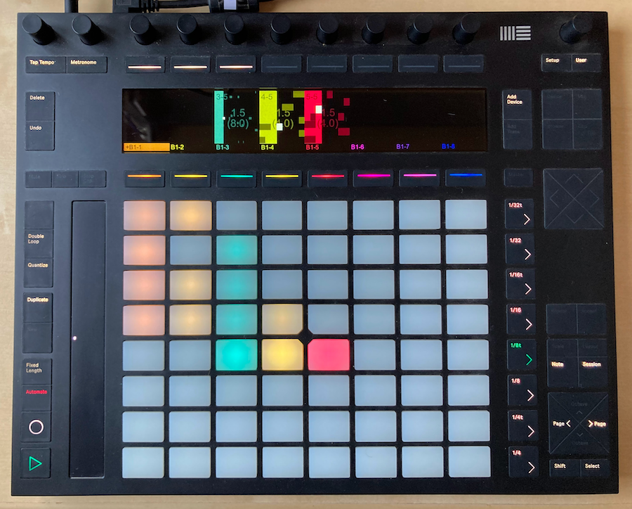
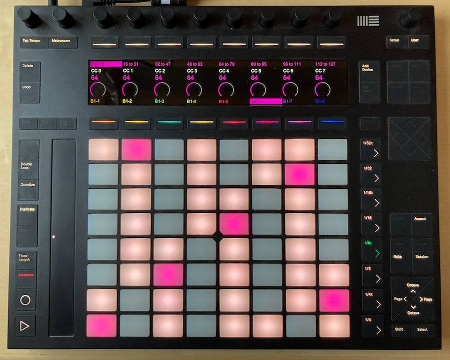

# Shepherd

Shepherd is an **open source MIDI sequencer** which I built to learn how sequencers work and to have an open, hackeable
environment to experiment with music sequencing. Shepherd consists of a *backend* application written in C++ using JUCE 
which does the actual sequencing of the MIDI messages (see [Shepherd](/tree/main/Shepherd) folder in this repo), and a *controller* application (written in Python) which controls
the backend and provides a user interface. Bi-directional communication between the backend and the controller is 
achieved using Web Sockets. Even though in this repository we provide code to make it very easy to develop alternative
controller applications using Python (see below), these could be developed in any other language as long as they 
support Web Sockets for communication with the backend and implement the communication protocol to send/receive 
messages to/from the backend.

One of my main goals when starting to develop Shepherd was that it should be able to run on a **Raspberry Pi** (Rpi) and 
should be controllable from a hardware device that should serve as its user interface. In particular, I focused on using
**Ableton's Push2** as the user interface for Shepherd. In the past I developed a Python package to control Ableton's 
Push2, [push2-python](https://github.com/ffont/push2-python), therefore I developed a Python-based controller for 
Shepherd that uses Push2 as the user interface. That *controller script* is provided in this repository in the 
[Push2Controller](/tree/main/Push2Controller) folder. To communicate with the backend, I implemented a Python
package, [pyshepherd](/tree/main/pyshepherd), which is used by Push2Controller, but that could be easily reuse by 
other controller scripts interfacing with the backend.

Shepherd is work in progress and will most likely be never finished. It is released under the **GPLv3** open source 
software license (see below) and I can't really provide support for it, but if anyone is trying to reuse it I'll be
happy to help.


## Shepherd Backend

The Shepherd backend implements a MIDI clip trigger system which works in an Ableton Live-like style. Shepherd *sessions* consist of a number of MIDI tracks and a number of scenes that must be defined when creating a new session (and can't be changed until a new session is loaded). This creates a *num tracks* * *num scenes* grid of MIDI clips that can be triggered independently, but only one clip per track can be played at the same time.

TODO: add more general information about the backend, block diagram, description of features


### Building the backend

The first step, common to all platforms, clone repository (with submodules):

```
git clone https://github.com/ffont/shepherd.git && cd shepherd && git submodule update --init
```

#### macOS

Before compiling, you'll need to install `openssl` (e.g. `brew install openssl`), as it is required for the backend.

Then you can compile the Shepherd backend from XCode (opening the XCode project in `Shepherd/Builds/MacOSX`), or from 
the terminal using `xcodebuild` command:

```
cd Shepherd/Builds/MacOSX
xcodebuild -arch 'x86_64' -configuration Release GCC_PREPROCESSOR_DEFINITIONS='$GCC_PREPROCESSOR_DEFINITIONS LLVM_LTO=NO'
```

Note that I'm not running an arm-based mac and I had to force-set the architecture in the build command 
(`-arch 'x86_64'`) to make it compile properly, not sure why...

If compiled from XCode, Shepherd will start running right after compilation, otherwise you can run it like:

```
cd Shepherd/Builds/MacOSX/build/Release/Shepherd.app/Contents/MacOS
./Shepherd
```

NOTE: If compiling in Debug mode (this is what XCode will do by default if you compile it from there), Shepherd backend
will open a window when running which will load the Push2 simulator implemented in Push2Controller (if available), but
this will not happen when running in Release mode.


#### Linux (including RaspberryPi running Raspbian)

Before compilation, you'll need to install [JUCE linux dependencies]( https://github.com/juce-framework/JUCE/blob/master/docs/Linux%20Dependencies.md
), and also `xvfb`, which is used to run Shepherd headlessly without any errors:

```
sudo apt update
sudo apt install libasound2-dev libjack-jackd2-dev \
    libcurl4-openssl-dev  \
    libfreetype6-dev \
    libx11-dev libxcomposite-dev libxcursor-dev libxcursor-dev libxext-dev libxinerama-dev libxrandr-dev libxrender-dev \
    libwebkit2gtk-4.0-dev \
    libglu1-mesa-dev mesa-common-dev
sudo apt-get install xvfb
```

Then, you can compile using `make`:

```
cd /home/pi/shepherd/Shepherd/Builds/LinuxMakefile
make CONFIG=Release -j4
```

Once compiled, you can run Shepherd backend like:

```
cd /home/pi/shepherd/Shepherd/Builds/LinuxMakefil/build/
./Shepherd
```


### Backend configuration files

Shepherd uses configuration files to set some general settings and, most importantly, to define a list of input/output
MIDI devices that will be accessible from the backend when running. In the context of Shepherd, these MIDI devices are
called *hardware devices* although this can include any type of devices that offers input/output MIDI ports, being it
a real hardware device or some software creating virtual MIDI ports. A `backendSettings.json` file and a 
`hardwareDevices.json` file should be placed in a 'Shepherd' folder in the user Documents folder 
(i.e. `~/Documents/Shepherd/`). Below are template to create these files.

#### backendSettings.json

This file is used to specify the MIDI devices that will be used to send metronome MIDI messages, to send MIDI clock
messages, and a special kind of MIDI clock syncing required to send tempo information to Ableton's push. This file
is **optional**, and if left blank then no metronome note messages and no MIDI clock data will be sent to any device.
This is how the `backendSettings.json` should look like:

```json
{
    "metronomeMidiDevice": "OUTPUT_MIDI_DEVICE_NAME",
    "metronomeMidiChannel": "MIDI_DEVICE_CHANNEL_FROM_1_TO_16",
    "midiDevicesToSendClockTo": ["OUTPUT_MIDI_DEVICE_NAME1", "OUTPUT_MIDI_DEVICE_NAME2", ...],
    "pushClockDeviceName": "OUTPUT_MIDI_DEVICE_NAME",
}
```

For example, in my Rpi-based setup, my `backendSettings.json` file looks like this: 

```json
{
    "metronomeMidiDevice": "ESI M4U eX MIDI 5",
    "metronomeMidiChannel": "16",
    "midiDevicesToSendClockTo": [],
    "pushClockDeviceName": "Ableton Push 2 MIDI 1",
}
```

#### hardwareDevices.json

This file **is mandatory** if you want Shepherd to be able to communicate with MIDI devices of any kind (which you
surely do as otherwise Shepherd is useless :)). Using this file you configure a number of input and  output 
*hardware devices* to which you give a name, indicate the corresponding MIDI port names and add some other extra info. 
This is how the `hardwareDevices.json` should look like:

```json
[
	{
            "type": "output",
            "name": "A GIVEN NAME",
	    "shortName": "A GIVEN NAME WHICH IS SHORTER",
	    "midiChannel": "MIDI_DEVICE_CHANNEL_TO_SEND_MESSAGES_TO_FROM_1_TO_16",
	    "midiOutputDeviceName": "OUTPUT_MIDI_DEVICE_NAME:"
	},{
            "type": "input",
            "name": "A GIVEN NAME",
	    "shortName": "A GIVEN NAME WHICH IS SHORTER",
	    "midiInputDeviceName": "INPUT_MIDI_DEVICE_NAME"
	},
	...
]
```

It can contain any number of input/output hardware devices. Here is an example `hardwareDevices.json` that I use in
my local development setup:

```json
[
	{
            "type": "output",
            "name": "Bus1 ch 1",
	    "shortName": "B1-1",
	    "midiChannel": 1,
	    "midiOutputDeviceName": "IAC Driver Bus 1"
	},{
            "type": "output",
            "name": "Bus1 ch 2",
	    "shortName": "B1-2",
	    "midiChannel": 2,
	    "midiOutputDeviceName": "IAC Driver Bus 1"
	},{
            "type": "output",
            "name": "Bus1 ch 3",
	    "shortName": "B1-3",
	    "midiChannel": 3,
	    "midiOutputDeviceName": "IAC Driver Bus 1"
	},{
            "type": "output",
            "name": "Bus1 ch 4",
	    "shortName": "B1-4",
	    "midiChannel": 4,
	    "midiOutputDeviceName": "IAC Driver Bus 1"
	},{
            "type": "output",
            "name": "Bus1 ch 5",
	    "shortName": "B1-5",
	    "midiChannel": 5,
	    "midiOutputDeviceName": "IAC Driver Bus 1"
	},{
            "type": "output",
            "name": "Bus1 ch 6",
	    "shortName": "B1-6",
	    "midiChannel": 6,
	    "midiOutputDeviceName": "IAC Driver Bus 1"
	},{
            "type": "output",
            "name": "Bus1 ch 7",
	    "shortName": "B1-7",
	    "midiChannel": 7,
	    "midiOutputDeviceName": "IAC Driver Bus 1"
	},{
            "type": "output",
            "name": "Bus1 ch 8",
	    "shortName": "B1-8",
	    "midiChannel": 8,
	    "midiOutputDeviceName": "IAC Driver Bus 1"
	},{
            "type": "input",
            "name": "Push",
	    "shortName": "Push",
	    "midiInputDeviceName": "Push2Simulator",
	    "controlChangeMessagesAreRelative": true,
	    "notesMapping": "-1,-1,-1,-1,-1,-1,-1,-1,-1,-1,-1,-1,-1,-1,-1,-1,-1,-1,-1,-1,-1,-1,-1,-1,-1,-1,-1,-1,-1,-1,-1,-1,-1,-1,-1,-1,-1,-1,-1,-1,-1,-1,-1,-1,-1,-1,-1,-1,-1,-1,-1,-1,-1,-1,-1,-1,-1,-1,-1,-1,-1,-1,-1,-1,-1,-1,-1,-1,-1,-1,-1,-1,-1,-1,-1,-1,-1,-1,-1,-1,-1,-1,-1,-1,-1,-1,-1,-1,-1,-1,-1,-1,-1,-1,-1,-1,-1,-1,-1,-1,-1,-1,-1,-1,-1,-1,-1,-1,-1,-1,-1,-1,-1,-1,-1,-1,-1,-1,-1,-1,-1,-1,-1,-1,-1,-1,-1,-1",
	    "controlChangeMapping": "-1,1,-1,-1,-1,-1,-1,-1,-1,-1,-1,-1,-1,-1,-1,-1,-1,-1,-1,-1,-1,-1,-1,-1,-1,-1,-1,-1,-1,-1,-1,-1,-1,-1,-1,-1,-1,-1,-1,-1,-1,-1,-1,-1,-1,-1,-1,-1,-1,-1,-1,-1,-1,-1,-1,-1,-1,-1,-1,-1,-1,-1,-1,-1,64,-1,-1,-1,-1,-1,-1,-1,-1,-1,-1,-1,-1,-1,-1,-1,-1,-1,-1,-1,-1,-1,-1,-1,-1,-1,-1,-1,-1,-1,-1,-1,-1,-1,-1,-1,-1,-1,-1,-1,-1,-1,-1,-1,-1,-1,-1,-1,-1,-1,-1,-1,-1,-1,-1,-1,-1,-1,-1,-1,-1,-1,-1,-1"
	},{
            "type": "input",
            "name": "iConKeyboard",
	    "shortName": "iConKeyboard",
	    "midiInputDeviceName": "iCON iKEY V1.02"
	}
]
```


## Shepherd Controllers

### Push2Controller

The Push2Controller is a Python 3 script which interacts with the Shepherd backend and a Push2 device to provide the UI.
To run Shepherd Controller you'll need to install the Python requirements and simply run the app:

```
pip install -r requirements.txt
python app.py
```
The Shepherd Controller app is based on 
[push2-python](https://github.com/ffont/push2-python). `push2-python` requires [pyusb](https://github.com/pyusb/pyusb) 
which is based in [libusb](https://libusb.info/). You'll most probably need to manually install `libusb` for your 
operative system if `pip install -r requirements.txt` does not do it for you. Moreover, to draw on Push2's screen, 
Push2Controller uses [`pycairo`](https://github.com/pygobject/pycairo) Python package. You'll most probably also 
need to install [`cairo`](https://www.cairographics.org/) if `pip install -r requirements.txt` does not do it for 
you (see [this page](https://pycairo.readthedocs.io/en/latest/getting_started.html) for info on that).

**NOTE**: if running Push2Controller in macOS, there seem to be compatibility issues with Python versions other than
3.8 so please use that Python version :).

Here are some screenshots of Push2Controller and Shepherd running using a real Push2 device:

<p align="center">

Session mode
</p>

<p align="center">

Melodic mode
</p>

<p align="center">

Clip edit mode
</p>

<p align="center">

Note edit mode
</p>

<p align="center">

Generator mode
</p>


#### Local development with Push2 simulator

The Push2Controller script initializes a Push2 simulator that can be used for development without the actual Push2 
device being connected. While running the script, you can open the simulator by pointing your browser at `localhost:6128`.
If running the backend in Debug mode, a window will automatically be opened which will run a simple web browser loading
`localhost:6128` so you don't need to manually open your browser. Here is a screenshot of the simulator in action:


#### Push2Controller device definition files

TODO


### pyshepherd

A Pythong package independent of Push2Controller is provided to develop Python-based apps that interact with Shepherd's
backend. All you need to do is to create a class that inherits from `pyshepherd.ShepherdBackendControllerApp` and
implement some abstract methods. Below is an example of a very simple testing app. `pyshepherd`'s docstrings (and the
examples provided in Push2Controller) should hopefully be enough to get you started using `pyshepherd` and making your
own Shepherd controller script.

````python
from pyshepherd.pyshepherd import ShepherdBackendControllerApp
import time


class App(ShepherdBackendControllerApp):

    def on_state_first_synced(self):
        # Create new empty session when  we first sync with backend
        self.session.new(num_tracks=2, num_scenes=1)

    def on_new_session_loaded(self):
        # When the session has been loaded, add events to some clips and play them
        clip = self.session.tracks[0].clips[0]
        clip.clear()
        clip.add_sequence_note_event(60, 1.0, 0.0, 0.5)
        clip.add_sequence_note_event(61, 1.0, 0.5, 0.5)
        clip.add_sequence_note_event(62, 1.0, 1.0, 0.5)
        clip.add_sequence_note_event(63, 1.0, 1.5, 0.5)
        clip.set_length(2.0)
        clip.play()

        clip = self.session.tracks[1].clips[0]
        clip.clear()
        clip.add_sequence_note_event(62, 1.0, 0.0, 0.5)
        clip.add_sequence_note_event(64, 1.0, 0.5, 0.5)
        clip.add_sequence_note_event(66, 1.0, 1.0, 0.5)
        clip.set_length(1.5)
        clip.play()

        self.session.play()

    def on_state_update_received(self, update_data):
        # Here we print state updates from Shepherd backend just to give an idea of the type of information that
        # is being exchanged
        print(update_data)

    def __init__(self, *args, **kwargs):
        super().__init__(*args, **kwargs)
        try:
            while True:
                time.sleep(1)
        except KeyboardInterrupt:
            if self.session is not None:
                self.session.stop()


if __name__ == "__main__":
    # Start the app and indicate a port in which the "state debugger" should run. While your app is running, point your
    # browser to http://localhost:5100 to see the whole Shepherd backend state as it has been synced with your 
    # controller script and converted to Python objects. This shows all the state information that is available to
    # the controller script and that can be used to provide the user interface.
    app = App(debugger_port=5100)
````


## Deploying Shepherd backend and Push2Controller in a Raspberry Pi

**NOTE**: All instructions below assume you have ssh connection with the Raspberry Pi. Here are the instructions 
for [enabling ssh](https://www.raspberrypi.org/documentation/remote-access/ssh/) on the Pi. Here are instructions 
for [setting up wifi networks](https://www.raspberrypi.org/documentation/configuration/wireless/wireless-cli.md). 
Also, here are instructions for [changing the hostname](https://thepihut.com/blogs/raspberry-pi-tutorials/19668676-renaming-your-raspberry-pi-the-hostname) 
of the Pi so for example you can access it like `ssh pi@shepherd`.

### Deploying Shepherd backend on Raspberry Pi

To run Shepherd on the Rapsberry Pi you need yo use `xvfb` to avoid window errors. This needs to be revised as this dependency can probably be removed quite easily. Use the following command to use Shepherd:

```
xvfb-run -a /home/pi/shepherd/Shepherd/Builds/LinuxMakefile/build/Shepherd
```

Alternatively, install following `systemd` service at `/lib/systemd/system/shepherd.service` (change paths is accordingly):

```
[Unit]
Description=shepherd
After=network-online.target

[Service]
Type=simple
WorkingDirectory=/home/pi/shepherd/
ExecStart=xvfb-run -a /home/pi/shepherd/Shepherd/Builds/LinuxMakefile/build/Shepherd
User=pi

[Install]
WantedBy=multi-user.target
```

Then you can enable the service...

```
sudo systemctl enable shepherd
```

...and start/stop/restart it with:

```
sudo systemctl start shepherd
sudo systemctl stop shepherd
sudo systemctl restart shepherd
```

Using that service configured, Shepherd will automatically be started after Raspberry Pi boots.

When running as a servie, check stdout with:

```
sudo journalctl -fu shepherd
```

### Deploying Push2Controller on Raspberry Pi

To run Shepherd Controller on the Rapsberry Pi you need to install Python requirements as described above. Then, a `systemd` service should be configured so that Shepherd Controller is run together with Shepherd. Create a file at `/lib/systemd/system/shepherd_cotroller.service` (change paths is accordingly):

These are instructions to get Shepherd Controller running on a Rapsberry Pi and load at startup. 

1. Install system dependencies
```
sudo apt-get update && sudo apt-get install -y libusb-1.0-0-dev libcairo2-dev python3 python3-pip git libasound2-dev libatlas-base-dev
```

2. Clone the app repository
```
git clone https://github.com/ffont/shepherd.git
```

3. Install Python dependencies
```
cd shepherd
pip3 install -r requirements.txt
```

4. Configure permissions for using libusb without sudo (untested with these specific commands, but should work)

Create a file in `/etc/udev/rules.d/50-push2.rules`...

    sudo nano /etc/udev/rules.d/50-push2.rules

...with these contents:

    add file contents: SUBSYSTEM=="usb", ATTR{idVendor}=="2982", ATTR{idProduct}=="1967", GROUP="audio"

Then run:

    sudo udevadm control --reload-rules
    sudo udevadm trigger


5. Configure Python script to run at startup:

Create file...

    sudo nano /lib/systemd/system/shepherd_controller.service

...with these contents:

```
[Unit]
Description=shepherd_controller
After=network-online.target

[Service]
WorkingDirectory=/home/pi/shepherd/Controller
ExecStart=/usr/bin/python3 app.py                                                
StandardOutput=syslog
User=pi
Restart=always
RestartSec=3

[Install]
WantedBy=multi-user.target
```

Then you can enable the service...

```
sudo systemctl enable shepherd_controller
```

...and start/stop/restart it with:

```
sudo systemctl start shepherd_controller
sudo systemctl stop shepherd_controller
sudo systemctl restart shepherd_controller
```

Using that service configured, Shepherd Controller will automatically be started after Raspberry Pi boots.

When running as a servie, check stdout with:

```
sudo journalctl -fu shepherd_controller
```


## License

Shepherd is released under the **GPLv3** open source software license 
(see [LICENSE](https://github.com/ffont/shepherd/blob/master/LICENSE) file) with the code being available 
at [https://github.com/ffont/shepherd](https://github.com/ffont/shepherd). Source uses the following open source 
software libraries: 

* [juce](https://juce.com), available under GPLv3 license ([@46ea879](https://github.com/juce-framework/JUCE/tree/2f980209cc4091a4490bb1bafc5d530f16834e58), v6.1.6)
* [asio](https://github.com/chriskohlhoff/asio), available under Boost Software License] ([@f0a1e1c](https://github.com/chriskohlhoff/asio/tree/f0a1e1c7c0387ad16358c81eb52528f190df625c))
* [Simple-WebSocket-Server](https://gitlab.com/eidheim/Simple-WebSocket-Server), available under MIT license ([@293a407](https://gitlab.com/eidheim/Simple-WebSocket-Server/-/tree/293a407f39fe50e285c8599b3d98a7da25371d20))
